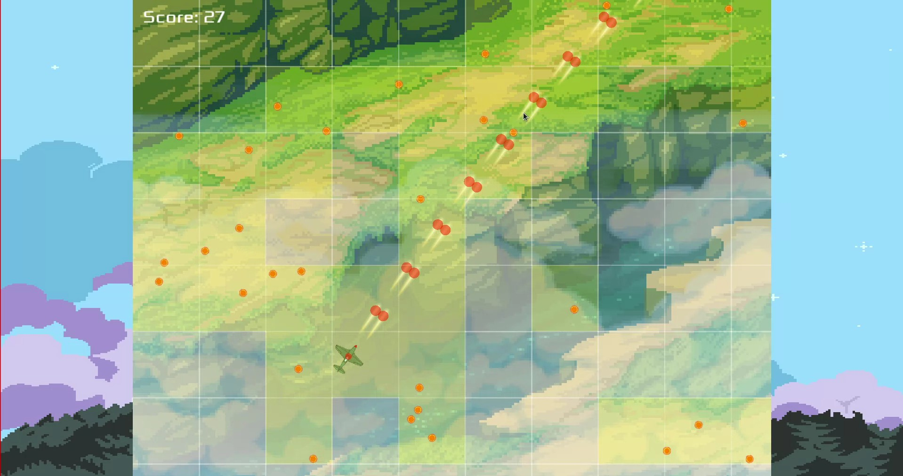

# Building blt

## Build requirements

- meson >= 0.49
- ninja (or other meson backend to use)

## Dependencies

- sfml >= 2.5.1
	- sfml-system
	- sfml-window
	- sfml-graphics
	- sfml-audio
- tgui >= 0.8

### Install dependencies

#### Ubuntu

```sh
sudo add-apt-repository ppa:texus/tgui-0.8
sudo apt-get update
sudo apt-get install libsfml-dev libtgui-dev
```

#### Arch Linux

```sh
sudo pacman -S sfml
yay -S tgui # yay is an AUR helper
```

## Build

```sh
cd blt
meson _build --buildtype=release
ninja -C _build
```

And run the game:

```sh
_build/src/blt
```

### Debug mode

In order to enable debug mode, add `-Ddebug_mode=true` option to meson build:

```sh
meson _build --buildtype=release -Ddebug_mode=true
```



### Install

Run (sudo) `ninja -C _build install` after meson build.

You can specify the installation prefix by adding a `--prefix` option to meson
build.

### Uninstall

- prefix: Installation prefix. e.g. /usr/local
- datadir: Data file subdirectory. e.g. share
- bindir: Executable subdirectory. e.g. bin

```sh
ninja -C _build uninstall
rm <prefix>/<datadir>/applications/blt.desktop
rm <prefix>/<bindir>/blt
```
