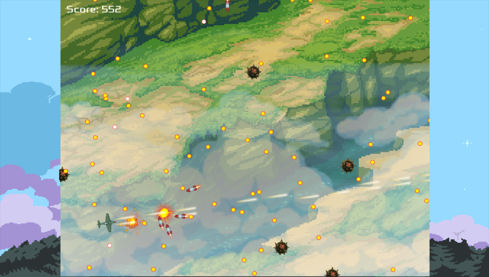

# yakblt

A simple bullet-dodging game written in C++.

I made it for a simple assignment in the past.

## How to play

- Move: W/A/S/D
- Rotation: The airplane looks at the mouse position
- Attack: Keep left mouse button pressed down

## Features

- Scene graph
- Grid spatial partitioning (Tiled collision detection)
- Scripting system

## Install

See the [installation guide](INSTALL.md).

## License

This program is released under the [MIT (Expat) License](COPYING).
