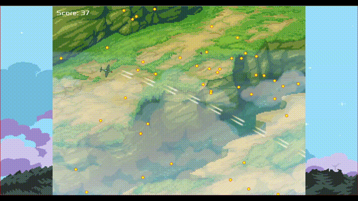
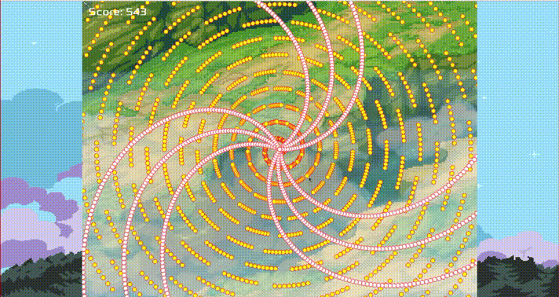

# blt: Just A Bullet Game

A shoot 'em up game written in C++.

I made it for an assignment a few years ago.

## How to play

- Move: W/A/S/D
- Rotation: The airplane looks at the mouse position
- Attack: Keep left mouse button pressed down

## Notable features

- Scene graph
- Grid spatial partitioning (Tiled collision detection)
- Scripting system

## Install

See the [installation guide](INSTALL.md).

## Notes

I purposely didn't use smart pointers to practice manual memory management.

## License

This program is released under the [MIT (Expat) License](COPYING).
